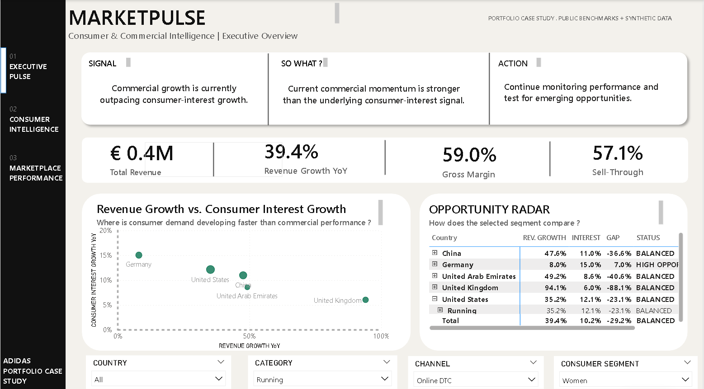
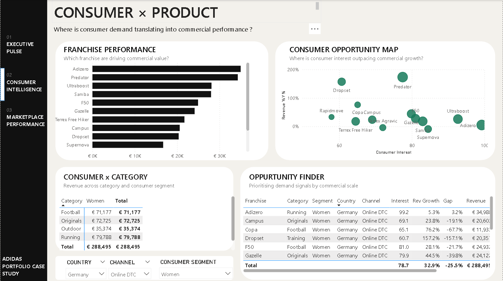
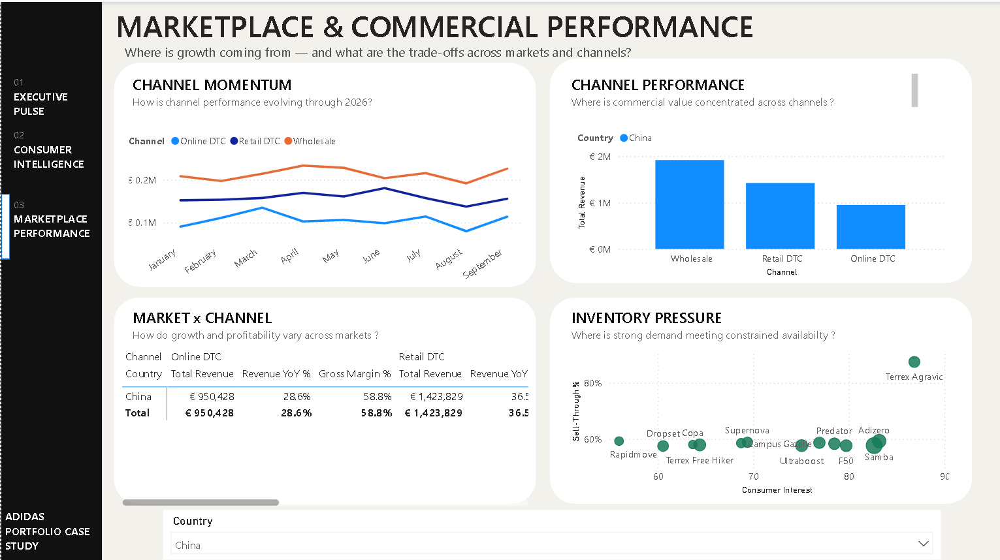

# MarketPulse
### Consumer & Commercial Intelligence Dashboard

A Power BI portfolio case study exploring how consumer demand signals can be connected with commercial performance across markets, categories, channels and consumer segments.

> **Portfolio Case Study**  
> MarketPulse is an independent student project and is not affiliated with adidas. Public adidas benchmarks are used for context, while granular transaction-level data is synthetic.



---

## The Business Question

**Where are the strongest commercial opportunities across market, category, channel and consumer segment — and what should the business investigate or act on next?**

MarketPulse was designed around a simple decision-support framework:

### SIGNAL → SO WHAT? → ACTION

Rather than only reporting KPIs, the dashboard connects changes in consumer interest with revenue growth, profitability, sell-through and inventory pressure to help identify areas worth investigating.

---

## Dashboard

MarketPulse contains three connected analytical views.

### 01 — Executive Pulse

A high-level view designed to identify where consumer demand and commercial performance are becoming misaligned.

The page combines:

- Revenue growth
- Consumer-interest growth
- Gross margin
- Sell-through
- Opportunity gaps
- Rule-based Signal → So What? → Action guidance

In the modelled scenario below, **Germany / Women / Running / Online DTC** emerges as an opportunity signal, with consumer-interest growth developing faster than revenue growth.


### 02 — Consumer × Product

A deeper view of consumer and product performance across franchises, categories and segments.

It helps investigate questions such as:

- Which franchises are creating the most commercial value?
- Where is consumer interest outpacing commercial growth?
- Which opportunities remain commercially meaningful after considering scale?



### 03 — Marketplace & Commercial Performance

A market and channel view focused on commercial momentum, profitability and inventory pressure.

It compares channel performance and highlights situations where strong demand may be meeting constrained availability.

The modelled China scenario makes **Terrex Agravic** stand out as an inventory-pressure signal through high consumer interest and sell-through.



---

## Data

Because granular adidas transaction data is not publicly available, MarketPulse uses a **hybrid data approach**.

The project combines:

- Public adidas company and performance benchmarks
- Derived assumptions for analytical modelling
- **30,000 synthetic transactions** covering January 2025–September 2026

The synthetic dataset spans:

**5 markets** · Germany · UK · US · China · UAE  
**5 categories** · Running · Football · Originals · Training · Outdoor  
**3 channels** · Online DTC · Retail DTC · Wholesale  
**3 consumer segments** · Women · Men · Unisex

Synthetic scenarios were intentionally designed to demonstrate different commercial questions. They do **not** represent actual adidas internal performance.

For additional detail, see [`docs/methodology.md`](docs/methodology.md).

---

## Modelled Commercial Scenarios

| Scenario | Business Question | Example Signal |
| --- | --- | --- |
| Consumer Opportunity | Is consumer demand developing faster than sales? | Germany · Women · Running · Online DTC |
| Growth vs. Profitability | Is strong growth translating into attractive economics? | US · Originals · Online DTC |
| Channel Momentum | How are growth patterns changing across channels? | UK · Online DTC vs. Wholesale |
| Inventory Pressure | Is strong demand meeting constrained availability? | China · Outdoor · Terrex Agravic |

---

## Insight Logic

MarketPulse includes a lightweight rule-based insight layer built in DAX.

Depending on the selected market, category, channel and consumer segment, the dashboard evaluates measures such as:

- Revenue YoY %
- Consumer Interest YoY %
- Opportunity Gap
- Gross Margin %
- Sell-Through %

It then dynamically generates:

**SIGNAL** — What changed?  
**SO WHAT?** — Why might it matter?  
**ACTION** — What should be investigated next?

This layer is designed as decision support rather than automated decision-making.

---

## Tools & Skills Demonstrated

**Power BI** · **Power Query** · **DAX** · **Data Modelling** · **KPI Design** · **Data Visualization** · **Consumer & Commercial Analysis** · **Business Storytelling**

---

## Repository Structure

```text
adidas-marketpulse/
├── dashboard/
│   └── adidas_MarketPulse.pbix
├── data/
│   ├── adidas_MarketPulse_synthetic_dataset.csv
│   ├── official_adidas_benchmarks.xlsx
│   └── data_dictionary.txt
├── screenshots/
│   ├── 01_executive_pulse.png
│   ├── 02_consumer_intelligence.png
│   └── 03_marketplace_performance.png
├── docs/
│   └── methodology.md
└── README.md
```

---

## Explore the Project

The complete interactive Power BI report is available here:

**[Open the MarketPulse Power BI report](dashboard/adidas_MarketPulse.pbix)**

The supporting synthetic dataset, public benchmark workbook and data documentation can be found in the **[data folder](data/)**.

For details on how the dataset and modelled scenarios were constructed, see the **[methodology](docs/methodology.md)**.

---

## About Me

**Noor Us Sabah**  
B.Sc. International Information Systems · Technische Hochschule Augsburg

Interested in using data to connect consumer behaviour, commercial performance and business decision-making.

**[LinkedIn](https://www.linkedin.com/in/nnoorussabahh)** · **[GitHub](https://github.com/nnoorussabah)**

---

*MarketPulse is an independent portfolio case study created for educational and career-development purposes. adidas is not affiliated with or responsible for this project. Granular commercial data shown in the dashboard is synthetic.*
